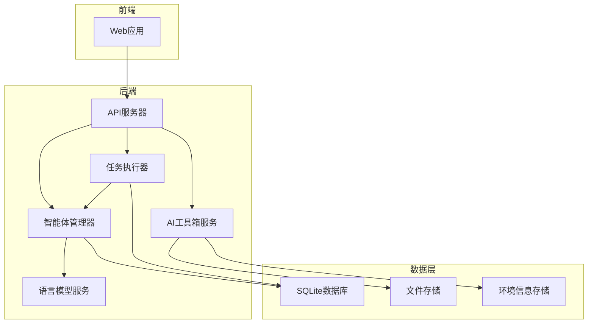

# Nix 多智能体AI协作平台架构文档

## 1. 系统概览

Nix 是一个多智能体AI协作平台，通过多个智能体的协同工作，为用户提供智能化的服务和解决方案。系统采用前后端分离架构，支持Web平台，具有高度的可扩展性和灵活性。

### 1.1 核心功能

- **AI 对话**：支持多模型配置切换，工作目录绑定，环境感知命令生成
- **智能体管理**：创建/配置智能体，绑定AI模型，智能体间互相调度
- **任务管理**：全链路任务创建/执行/监控，实时WebSocket状态同步
- **AI 工具箱**：文件操作（搜索/读取/创建/编辑/删除）、终端命令执行、Browser-Use浏览器操控、MCP工具集成、数据库连接管理
- **Skills 管理**：Markdown文件目录树管理，按功能分类组织技能定义
- **系统设置**：多厂商API Key管理（支持多模型列表）、数据库连接配置、环境检测与持久化、用户头像管理

### 1.2 技术栈

| 类别 | 技术 | 版本 | 选型理由 |
|------|------|------|----------|
| 前端框架 | React + TypeScript | 18.x + 5.3 | 跨平台支持，组件化架构，类型安全 |
| 路由 | React Router | v6 | 声明式路由，支持嵌套路由和路由守卫 |
| 状态管理 | React Context API | 内置 | 简化状态管理，减少依赖 |
| UI库 | 原生CSS（毛玻璃风格） | - | 减少第三方库依赖，独特视觉风格 |
| 后端语言 | Python | 3.10+ | 丰富的AI/ML库支持，生态系统成熟 |
| 后端框架 | FastAPI | 0.104+ | 高性能异步框架，自动API文档生成 |
| 数据库 | SQLite | 3.40+ | 简化部署，无需额外服务 |
| ORM | SQLAlchemy | 2.0 | 现代化ORM，类型提示支持 |
| 数据验证 | Pydantic | 2.5 | 与FastAPI深度集成，性能优异 |
| 智能体框架 | LangChain + langchain-openai | - | 标准化LLM调用接口 |
| 浏览器自动化 | Playwright | - | 支持Chromium/Firefox/WebKit |
| 实时通信 | WebSocket (FastAPI内置) | - | 减少Socket.IO依赖 |
| 部署 | Docker Compose | 2.20+ | 简化部署和管理 |

## 2. 系统架构

### 2.1 架构概览

系统采用简化的分层架构，包括前端、后端和数据层。各层之间通过明确的接口进行通信，确保系统的模块化和可扩展性。



### 2.2 核心流程

1. **智能体创建与管理流程**
   - 用户通过前端界面创建智能体
   - API服务器验证用户权限并创建智能体记录
   - 智能体管理器初始化智能体实例
   - 智能体状态持久化到SQLite数据库

2. **智能体协作流程**
   - 用户提交任务请求
   - 任务执行器分析任务类型和需求
   - 智能体管理器选择合适的智能体
   - 智能体执行任务并生成结果
   - 任务执行结果返回给用户

3. **AI对话流程**
   - 用户选择模型配置并发送消息
   - 后端根据配置实例化对应的LLM
   - LangChain构建消息列表并调用模型
   - 返回AI回复并展示在前端

4. **实时通信流程**
   - 前端通过WebSocket连接到API服务器
   - 智能体和任务状态变化通过WebSocket推送到前端
   - 用户与系统的交互实时传递

## 3. 组件设计

### 3.1 前端组件

| 组件名称 | 功能描述 | 技术实现 | 所在文件 |
|---------|---------|---------|---------|
| ChatPanel | AI对话面板，支持多模型切换 | React + WebSocket | src/components/ChatPanel.tsx |
| AgentDashboard | 智能体管理与调度 | React + API | src/components/AgentDashboard.tsx |
| TaskManager | 任务管理界面 | React + WebSocket | src/components/TaskManager.tsx |
| AIToolbox | AI工具箱（文件/终端/浏览器/MCP/数据库） | React + 多API集成 | src/components/AIToolbox.tsx |
| SkillsManager | Skills文件目录树管理 | React + 目录树 | src/components/SkillsManager.tsx |
| SettingsPanel | 系统设置（API Key/数据库/环境） | React + 表单 | src/components/SettingsPanel.tsx |
| AuthComponent | 用户认证 | React + JWT | src/components/AuthComponent.tsx |
| TaskFlow | 任务流程可视化 | React + Mermaid | src/components/TaskFlow.tsx |
| MermaidDiagram | 图表渲染 | React + Mermaid | src/components/MermaidDiagram.tsx |

### 3.2 后端服务

| 服务名称 | 功能描述 | 技术实现 | 所在文件 |
|---------|---------|---------|---------|
| AuthService | 用户认证与授权 | FastAPI + JWT | backend/services/auth.py |
| AgentManager | 智能体生命周期管理 | FastAPI + LangChain | backend/services/agent_manager.py |
| TaskExecutor | 任务执行 | FastAPI | backend/services/task_executor.py |
| LLMService | 语言模型接口 | FastAPI + OpenAI API | backend/services/llm_service.py |

### 3.3 智能体核心组件

| 组件名称 | 功能描述 | 技术实现 | 所在文件 |
|---------|---------|---------|---------|
| AgentBase | 智能体基类 | Python + LangChain | backend/agents/base.py |
| AgentFactory | 智能体工厂 | Python + LangChain | backend/agents/factory.py |
| ChatAgent | 聊天智能体 | Python + LangChain | backend/agents/chat_agent.py |
| DefaultAgent | 默认智能体 | Python + LangChain | backend/agents/default_agent.py |

### 3.4 数据模型

| 模型名称 | 功能描述 | 技术实现 | 所在文件 |
|---------|---------|---------|---------|
| User | 用户模型 | SQLAlchemy | backend/models/user.py |
| Agent | 智能体模型 | SQLAlchemy | backend/models/agent.py |
| Task | 任务模型 | SQLAlchemy | backend/models/task.py |
| ApiKeyConfig | API密钥配置 | SQLAlchemy | backend/models/api_key_config.py |
| DbConnection | 数据库连接 | SQLAlchemy | backend/models/db_connection.py |
| EnvironmentInfo | 环境信息 | SQLAlchemy | backend/models/environment.py |
| Workflow | 工作流 | SQLAlchemy | backend/models/workflow.py |

## 4. API 设计

### 4.1 认证API

| 端点 | 方法 | 功能描述 | 请求体 | 响应 |
|------|------|---------|--------|------|
| /api/auth/register | POST | 用户注册 | `{"username": "...", "email": "...", "password": "..."}` | `{"id": 1, "username": "...", "email": "...", "token": "..."}` |
| /api/auth/login | POST | 用户登录 | `{"email": "...", "password": "..."}` | `{"access_token": "...", "token_type": "bearer"}` |
| /api/auth/profile | GET | 获取用户资料 | N/A | `{"id": 1, "username": "...", "email": "...", "avatar": "..."}` |
| /api/auth/profile | PUT | 更新用户资料 | `{"username": "...", "email": "...", "avatar": "..."}` | `{"id": 1, "username": "...", "email": "...", "avatar": "..."}` |

### 4.2 智能体API

| 端点 | 方法 | 功能描述 | 请求体 | 响应 |
|------|------|---------|--------|------|
| /api/agents | GET | 获取智能体列表 | N/A | `[{"id": 1, "name": "...", "type": "...", "status": "..."}]` |
| /api/agents | POST | 创建智能体 | `{"name": "...", "type": "...", "config": {...}}` | `{"id": 1, "name": "...", "type": "...", "status": "..."}` |
| /api/agents/{id} | GET | 获取智能体详情 | N/A | `{"id": 1, "name": "...", "type": "...", "config": {...}, "status": "..."}` |
| /api/agents/{id} | PUT | 更新智能体 | `{"name": "...", "config": {...}}` | `{"id": 1, "name": "...", "type": "...", "config": {...}, "status": "..."}` |
| /api/agents/{id} | DELETE | 删除智能体 | N/A | `{"message": "Agent deleted successfully"}` |
| /api/agents/{id}/start | POST | 启动智能体 | N/A | `{"status": "running"}` |
| /api/agents/{id}/stop | POST | 停止智能体 | N/A | `{"status": "stopped"}` |
| /api/agents/{id}/model | GET | 获取智能体绑定的模型配置 | N/A | `{"agent_id": 1, "config_id": 1, "name": "...", "vendor": "..."}` |
| /api/agents/{id}/dispatch | POST | 向其他智能体派发任务 | `{"source_agent_id": 1, "target_agent_id": 2, "task_name": "..."}` | `{"success": true, "task_id": 1}` |
| /api/agents/schedule/available | GET | 获取可调度的智能体列表 | N/A | `[{"agent_id": 1, "agent_name": "...", "available": true}]` |
| /api/agents/schedule/auto | POST | 自动调度任务到最合适的智能体 | `{"task_name": "...", "preferred_agent_type": "..."}` | `{"success": true, "task_id": 1, "assigned_agent_id": 1}` |

### 4.3 任务API

| 端点 | 方法 | 功能描述 | 请求体 | 响应 |
|------|------|---------|--------|------|
| /api/tasks | GET | 获取任务列表（支持筛选） | N/A | `[{"id": 1, "name": "...", "status": "...", "created_at": "..."}]` |
| /api/tasks | POST | 创建任务 | `{"name": "...", "description": "...", "agent_id": 1}` | `{"id": 1, "name": "...", "status": "pending", "created_at": "..."}` |
| /api/tasks/{id} | GET | 获取任务详情 | N/A | `{"id": 1, "name": "...", "description": "...", "status": "...", "agent_id": 1}` |
| /api/tasks/{id} | PUT | 更新任务 | `{"status": "...", "description": "..."}` | `{"id": 1, "name": "...", "status": "...", "description": "..."}` |
| /api/tasks/{id} | DELETE | 删除任务 | N/A | `{"message": "Task deleted successfully"}` |
| /api/tasks/{id}/execute | POST | 执行任务 | N/A | `{"message": "Task execution triggered", "task_id": 1, "status": "..."}` |

### 4.4 AI对话API

| 端点 | 方法 | 功能描述 | 请求体 | 响应 |
|------|------|---------|--------|------|
| /api/chat/configs | GET | 获取可用的对话配置列表 | N/A | `[{"id": 1, "name": "...", "vendor": "...", "model_name": "..."}]` |
| /api/chat | POST | 发送对话消息 | `{"config_id": 1, "messages": [...], "model": "..."}` | `{"reply": "...", "model_name": "...", "vendor": "...", "config_name": "..."}` |

### 4.5 AI工具箱API

| 端点 | 方法 | 功能描述 | 请求体 | 响应 |
|------|------|---------|--------|------|
| /api/toolbox/files/search | POST | 全文检索文件内容 | `{"query": "...", "directory": ".", "file_pattern": "*"}` | `{"matches": [...], "total_count": 0}` |
| /api/toolbox/files/locate | POST | 按关键字定位文件内容 | `{"keyword": "...", "directory": ".", "context_lines": 3}` | `{"matches": [...], "total_count": 0}` |
| /api/toolbox/files/find | GET | 按名称模式查找文件 | Query: `pattern`, `directory`, `use_regex` | `{"files": [...], "total_count": 0}` |
| /api/toolbox/files/read | GET | 读取文件内容 | Query: `path`, `start_line`, `end_line` | `{"path": "...", "content": "...", "total_lines": 0}` |
| /api/toolbox/files/create | POST | 创建新文件 | `{"path": "...", "content": "..."}` | `{"success": true, "message": "...", "path": "..."}` |
| /api/toolbox/files/update | PUT | 更新文件内容 | `{"path": "...", "content": "..."}` | `{"success": true, "message": "...", "path": "..."}` |
| /api/toolbox/files/delete | DELETE | 删除文件 | Query: `path`, `confirm` | `{"success": true, "message": "...", "path": "..."}` |
| /api/toolbox/terminal/execute | POST | 执行终端命令 | `{"command": "...", "working_directory": "...", "timeout": 30}` | `{"success": true, "exit_code": 0, "stdout": "...", "stderr": "..."}` |
| /api/toolbox/browser/navigate | POST | 浏览器导航到URL | `{"url": "...", "wait_load": true}` | `{"success": true, "data": {"url": "...", "title": "..."}}` |
| /api/toolbox/browser/screenshot | POST | 截取浏览器截图 | `{"full_page": false}` | `{"success": true, "data": {"screenshot": "..."}}` |
| /api/toolbox/browser/click | POST | 点击页面元素 | `{"selector": "...", "wait_after": 1}` | `{"success": true, "data": {"url": "...", "title": "..."}}` |
| /api/toolbox/browser/type | POST | 在输入框中输入文本 | `{"selector": "...", "text": "..."}` | `{"success": true, "data": {"selector": "...", "text_length": 0}}` |
| /api/toolbox/browser/extract | POST | 提取页面内容 | `{"selector": "..."}` | `{"success": true, "data": {"text": "...", "count": 0}}` |
| /api/toolbox/mcp/tools | GET | 列出所有可用的MCP工具 | N/A | `{"tools": [...], "total_count": 0}` |
| /api/toolbox/mcp/execute | POST | 通过MCP协议执行工具 | `{"tool_name": "...", "parameters": {...}}` | `{"success": true, "tool_name": "...", "result": {...}}` |
| /api/toolbox/directories/browse | GET | 浏览服务器目录结构 | Query: `path` | `{"current_path": "...", "parent_path": "...", "directories": [...]}` |
| /api/toolbox/agent-task | POST | AI建议创建任务 | `{"agent_id": 1, "task_name": "...", "task_description": "..."}` | `{"id": 1, "agent_id": 1, "task_name": "...", "status": "pending_confirmation"}` |

### 4.6 系统设置API

| 端点 | 方法 | 功能描述 | 请求体 | 响应 |
|------|------|---------|--------|------|
| /api/settings | GET | 获取API Key配置列表 | N/A | `[{"id": 1, "name": "...", "vendor": "...", "model_name": "..."}]` |
| /api/settings | POST | 创建API Key配置 | `{"name": "...", "vendor": "...", "api_key": "...", "model_name": "..."}` | `{"id": 1, "name": "...", "vendor": "...", "model_name": "..."}` |
| /api/settings/{id} | GET | 获取配置详情 | N/A | `{"id": 1, "name": "...", "vendor": "...", "api_key": "...", "model_name": "..."}` |
| /api/settings/{id} | PUT | 更新配置 | `{"name": "...", "api_key": "...", "model_name": "..."}` | `{"id": 1, "name": "...", "vendor": "...", "model_name": "..."}` |
| /api/settings/{id} | DELETE | 删除配置 | N/A | `{"message": "Deleted"}` |
| /api/settings/fetch-models | POST | 获取厂商模型列表 | `{"model_list_url": "...", "api_key": "...", "vendor": "..."}` | `{"models": [...], "raw_count": 0, "vendor": "..."}` |

### 4.7 数据库连接API

| 端点 | 方法 | 功能描述 | 请求体 | 响应 |
|------|------|---------|--------|------|
| /api/db-connections | GET | 获取数据库连接列表 | N/A | `[{"id": 1, "name": "...", "host": "...", "port": 3306}]` |
| /api/db-connections | POST | 创建数据库连接 | `{"name": "...", "host": "...", "port": 3306, "username": "...", "password": "..."}` | `{"id": 1, "name": "...", "host": "...", "port": 3306}` |
| /api/db-connections/{id} | GET | 获取连接详情 | N/A | `{"id": 1, "name": "...", "host": "...", "port": 3306}` |
| /api/db-connections/{id} | PUT | 更新连接 | `{"name": "...", "host": "...", "port": 3306}` | `{"id": 1, "name": "...", "host": "...", "port": 3306}` |
| /api/db-connections/{id} | DELETE | 删除连接 | N/A | `{"message": "Deleted"}` |
| /api/db-connections/{id}/test | POST | 测试数据库连接 | N/A | `{"success": true, "message": "...", "latency_ms": 0}` |

### 4.8 Skills管理API

| 端点 | 方法 | 功能描述 | 请求体 | 响应 |
|------|------|---------|--------|------|
| /api/skills/tree | GET | 获取Skills目录树 | N/A | `{"tree": [...]}` |
| /api/skills/file | GET | 读取Skill文件内容 | Query: `path` | `{"path": "...", "name": "...", "content": "...", "size": 0}` |
| /api/skills/file | POST | 创建Skill文件 | `{"path": "...", "content": "..."}` | `{"success": true, "message": "...", "path": "..."}` |
| /api/skills/file | PUT | 更新Skill文件 | `{"path": "...", "content": "..."}` | `{"success": true, "message": "...", "path": "..."}` |
| /api/skills/file | DELETE | 删除Skill文件 | Query: `path` | `{"success": true, "message": "...", "path": "..."}` |
| /api/skills/directory | POST | 创建Skills目录 | `{"path": "..."}` | `{"success": true, "message": "...", "path": "..."}` |
| /api/skills/directory | DELETE | 删除Skills目录 | Query: `path` | `{"success": true, "message": "...", "path": "..."}` |

### 4.9 环境检测API

| 端点 | 方法 | 功能描述 | 请求体 | 响应 |
|------|------|---------|--------|------|
| /api/environment/detect | GET | 自动检测当前环境信息 | N/A | `{"os_name": "...", "os_version": "...", "architecture": "...", "shell": "...", "tech_stack": {...}}` |
| /api/environment/auto | GET | 自动检测（优先读取缓存） | Query: `workspace` | `{"os_name": "...", "os_version": "...", "architecture": "...", "shell": "...", "tech_stack": {...}}` |
| /api/environment/save | POST | 检测并保存环境信息 | Query: `workspace` | `{"id": 1, "os_name": "...", "os_version": "...", ...}` |
| /api/environment/summary | GET | 获取精简环境摘要 | Query: `workspace` | `{"summary": "...", "raw": {...}}` |
| /api/environment/info | GET | 获取已保存的环境信息 | N/A | `{"id": 1, "os_name": "...", "os_version": "...", ...}` |
| /api/environment/update | PUT | 手动更新环境信息 | `{"os_name": "...", "os_version": "..."}` | `{"id": 1, "os_name": "...", "os_version": "...", ...}` |

### 4.10 工作流API

| 端点 | 方法 | 功能描述 | 请求体 | 响应 |
|------|------|---------|--------|------|
| /api/workflow/ | POST | 创建工作流步骤 | `{"task_id": 1, "name": "...", "order": 1}` | `{"id": 1, "task_id": 1, "name": "...", "order": 1}` |
| /api/workflow/task/{task_id} | GET | 获取任务的工作流步骤 | N/A | `[{"id": 1, "task_id": 1, "name": "...", "order": 1}]` |
| /api/workflow/{id} | GET | 获取工作流步骤详情 | N/A | `{"id": 1, "task_id": 1, "name": "...", "order": 1}` |
| /api/workflow/{id} | PUT | 更新工作流步骤 | `{"name": "...", "order": 2}` | `{"id": 1, "task_id": 1, "name": "...", "order": 2}` |
| /api/workflow/{id} | DELETE | 删除工作流步骤 | N/A | `{"message": "Workflow step deleted successfully"}` |

## 5. 数据流设计

### 5.1 数据流向

1. **用户请求流**
   - 用户通过前端界面发起请求
   - 前端组件处理用户输入并发送到后端API
   - API服务器处理请求并返回响应
   - 前端接收响应并更新界面

2. **智能体协作流**
   - 任务执行器创建任务并分配给智能体
   - 智能体执行任务并生成结果
   - 结果存储到SQLite数据库并返回给用户

3. **AI对话流**
   - 用户选择模型配置并发送消息
   - 后端通过LangChain调用对应LLM
   - 模型返回结果，后端格式化后返回前端

4. **实时通信流**
   - 前端通过WebSocket连接到API服务器
   - 智能体和任务状态变化触发事件
   - API服务器将事件推送到前端
   - 前端更新界面显示最新状态

### 5.2 数据存储

- **用户数据**: 存储在SQLite数据库中
- **智能体配置**: 存储在SQLite数据库中
- **任务信息**: 存储在SQLite数据库中
- **API Key配置**: 存储在SQLite数据库中
- **数据库连接**: 存储在SQLite数据库中
- **环境信息**: 存储在SQLite数据库中，同时持久化到 `.nix/environment.json`
- **Skills文件**: 存储在文件系统的 `skills/` 目录下
- **文件数据**: 存储在文件系统中

## 6. 部署与运维

### 6.1 部署架构

系统采用容器化部署，使用Docker Compose进行管理。部署架构包括：

- **前端部署**: 容器化部署
- **后端服务**: 容器化部署
- **数据库**: SQLite数据库（内置）
- **文件存储**: 本地文件系统

### 6.2 环境配置

| 环境 | 配置 | 用途 |
|------|------|------|
| 开发环境 | 本地Docker Compose | 开发和测试 |
| 测试环境 | 云服务器Docker Compose | 集成测试 |
| 生产环境 | Docker Compose | 生产部署 |

### 6.3 部署配置

```yaml
# docker-compose.yml
version: '3.8'
services:
  backend:
    build: ./backend
    ports:
      - "8000:8000"
    volumes:
      - ./backend:/app
      - data:/app/data
    environment:
      - DATABASE_URL=sqlite:///./data/db.sqlite
      - OPENAI_API_KEY=${OPENAI_API_KEY}

  frontend:
    build: ./frontend
    ports:
      - "3000:3000"
    volumes:
      - ./frontend:/app
    environment:
      - REACT_APP_API_URL=http://localhost:8000

volumes:
  data:
```

### 6.4 开发流程

1. **克隆代码库**: `git clone <repository-url> && cd Nix`
2. **启动服务**: `docker-compose up --build`
3. **访问应用**: 前端 http://localhost:3000，后端API文档 http://localhost:8000/docs

## 7. 安全设计

### 7.1 认证与授权

- **JWT认证**: 使用JSON Web Token进行无状态认证
- **RBAC授权**: 基于角色的访问控制
- **密码加密**: 使用bcrypt进行密码哈希
- **API保护**: 所有API端点都需要认证

### 7.2 数据安全

- **数据加密**: 敏感数据加密存储
- **传输加密**: 使用HTTPS进行数据传输
- **数据库安全**: 最小权限原则配置数据库用户
- **备份策略**: 定期数据备份

### 7.3 系统安全

- **容器安全**: 最小化容器镜像，定期更新
- **网络安全**: 网络隔离，防火墙配置
- **日志审计**: 所有操作都有日志记录
- **漏洞扫描**: 定期进行安全扫描

## 8. 性能优化

### 8.1 前端优化

- **代码分割**: 按需加载代码
- **缓存策略**: 合理使用浏览器缓存
- **状态管理优化**: 减少不必要的状态更新
- **渲染优化**: 使用React.memo和useCallback

### 8.2 后端优化

- **异步处理**: 使用FastAPI的异步特性
- **数据库优化**: 合理索引，查询优化
- **缓存策略**: 使用Redis缓存热点数据
- **负载均衡**: 多实例部署，负载均衡

### 8.3 智能体优化

- **模型选择**: 根据任务选择合适的模型
- **批处理**: 批量处理任务提高效率
- **资源管理**: 合理分配计算资源
- **记忆优化**: 智能体记忆的有效管理

## 9. 扩展性设计

### 9.1 水平扩展

- **服务拆分**: 微服务架构，独立部署
- **容器化**: 使用Kubernetes进行自动扩缩容
- **负载均衡**: 多实例部署，负载均衡

### 9.2 功能扩展

- **插件系统**: 支持第三方插件
- **API扩展**: 开放API，支持集成
- **智能体扩展**: 支持自定义智能体类型
- **工具扩展**: 支持自定义工具

### 9.3 技术扩展

- **模型扩展**: 支持多种语言模型
- **存储扩展**: 支持多种存储后端
- **通信扩展**: 支持多种通信协议

## 10. 监控与维护

### 10.1 监控系统

- **应用监控**: 内置日志系统
- **性能监控**: 响应时间，资源使用率
- **健康检查**: 定期健康检查

### 10.2 维护策略

- **定期更新**: 定期更新依赖和安全补丁
- **备份策略**: 定期SQLite数据库备份
- **故障恢复**: 简单故障恢复计划
- **性能优化**: 定期性能分析和优化

## 11. 开发指南

### 11.1 开发环境搭建

1. **克隆代码库**
   ```bash
   git clone <repository-url>
   cd Nix
   ```

2. **启动服务**
   ```bash
   docker-compose up --build
   ```

3. **访问应用**
   - 前端: http://localhost:3000
   - 后端API文档: http://localhost:8000/docs

4. **开发流程**
   - 前端代码修改后会自动热重载
   - 后端代码修改后会自动重启

### 11.2 代码规范

- **前端**: ESLint + Prettier
- **后端**: PEP 8 + Black
- **提交规范**: Conventional Commits

### 11.3 测试策略

- **单元测试**: 每个组件的单元测试
- **集成测试**: 服务间集成测试
- **端到端测试**: 完整流程测试

## 12. 总结

本架构设计为Nix多智能体AI协作平台提供了一个完整的技术方案，包括系统架构、组件设计、API设计、数据流设计、部署与运维、安全设计、性能优化、扩展性设计、监控与维护和开发指南。

系统采用现代化的技术栈，具有高度的可扩展性和灵活性，能够满足多智能体协作、AI对话、AI工具箱、Skills管理等各种需求。同时，系统设计考虑了安全性、性能和可维护性，为用户提供稳定、高效、安全的多智能体协作平台。
